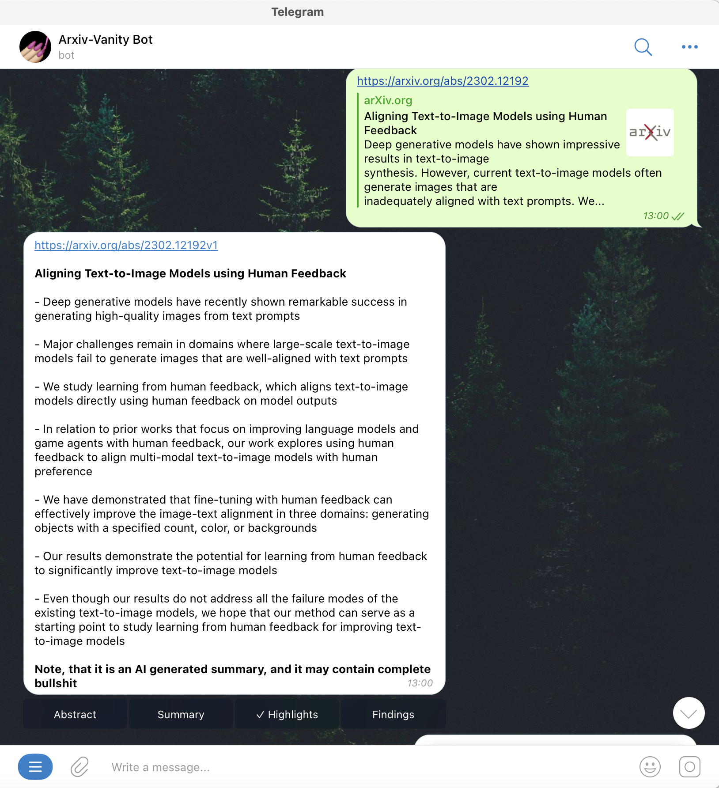

# arxiv-vanity-bot for telegram

Telegram for some reason doesn't show snippets for links from arxiv.org site. This bot created to get work around of this problem. It is useful to having this bot in chats where you can share links from arxiv and bot will replying on that messages with some kind of snippets with title and description of paper and link to mobile friendly service for arxiv papers - arxiv-vanity.com

Also there is functionality of get summary of a paper with short highlights and findings. It is useful to get familiar with main findings of a paper and decide to read or not :)

Ready to use bot: https://t.me/arxiv_vanity_bot

## TODO
Sometime I implement the functionality of getting Figures from a paper, because pictures is very important to understand what's going on :)

## Installation

```bash
git clone https://github.com/metya/vanity-bot
```

After that create file in the root of repository with name "token" and put there text below

```plaintext
API_TOKEN=your_bot_token
```

And after that just

```bash
docker compose up -d
```

or use environment variables with compose instead of token file

```bash
docker-compose run -d -e API_TOKEN=your_bot_token bot
```

## Usage

Add your bot in chat where you discuss arxiv papers and enjoy. Or use my bot https://t.me/arxiv_vanity_bot

## Illustration

